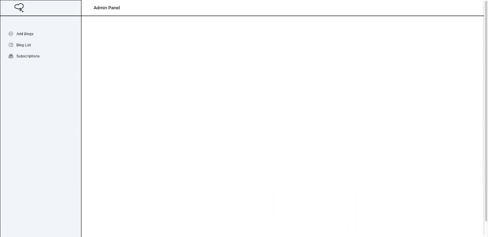

#  SNACKABLE THOUGHTS

## About
- A full-stack blog application built with Next.js and MongoDB. This project features separate frontends for users and administrators, as well as a backend that handles data fetching, authentication, and CRUD operations.

## Features: 
- User Frontend
    - Browse blog posts
    - View individual posts with comments
    - Search and filter posts by categories
- Admin Frontend:
    - Manage blog posts (create, update, delete)
    - View and manage user comments
    - Dashboard for analytics and content management
- Backend:
    - API routes to handle CRUD operations for posts, comments, and users
    - MongoDB integration for data persistence
    - Authentication using JWT or sessions for admin login

## Preview:
- User Fronted
-  User Fronted

-  Admin Frontend
    - You will need a code to access the admin panel and a code to delete a blog or an email 

## Tech Stack

 

 

 

 

 

 

